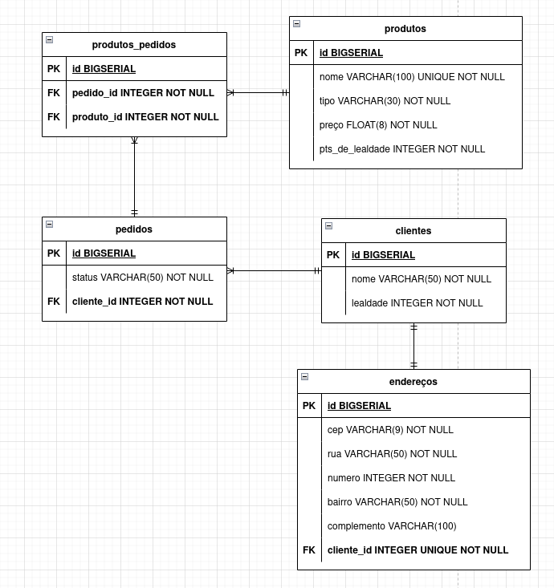

# sqlanches

Estruturar um banco de dados que possui todos os tipos de relacionamentos.

O contexto é a SQLanches, uma lancheria que vende hambúrgueres, acompanhamentos e bebidas.

As entidades (tabelas) que fazem parte desse contexto são as seguintes:

- Clientes
- Endereços
- Produtos
- Pedidos
- Produtos_Pedidos (tabela pivô)

### **Desenvolver a criação das tabelas usando o Beekeeper.**
